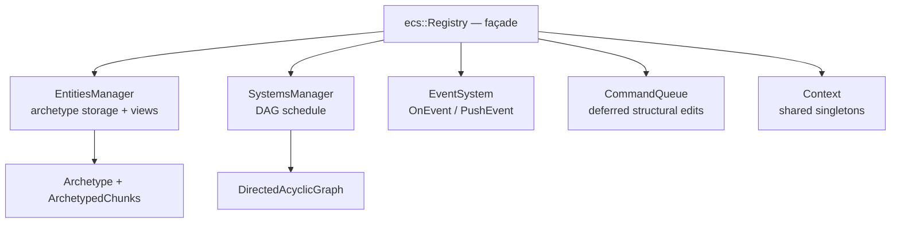

<h1 align="center">R-ECS</h1>

<p align="center">
  <b>Replication · Entities · Components · Systems</b><br>
  An archetype-based Entity-Component-System framework for modern C++.
</p>

<p align="center">
  
  
  
  
  
</p>

<p align="center">
  📖 <a href="docs/README.md">Documentation</a> &nbsp;·&nbsp;
  🚀 <a href="examples/README.md">Examples</a> &nbsp;·&nbsp;
  🇬🇧 <a href="docs/en/README.md">English docs</a> &nbsp;·&nbsp;
  🇷🇺 <a href="docs/ru/README.md">Русская документация</a>
</p>

---

## ⚡ What is R-ECS?

R-ECS is a high-performance **Entity-Component-System** framework written in
**C++20**, aimed at game development and real-time simulation. It uses an
**archetype-based** architecture: entities that share the same set of components
are stored together in packed chunks, giving excellent cache locality on
iteration while keeping the public API small and declarative.

```cpp
for (auto [pos, vel] : registry.Entities().view<Position2d, Velocity2d>())
{
    pos.x += vel.x;
    pos.y += vel.y;
}
```

## ✨ Highlights

- **Archetype storage** — dense, packed chunks with swap-remove; views walk
  contiguous memory.
- **Declarative systems** — inherit `ISystem<T>`, tag with `ECS_REGISTRY`, and
  the framework auto-registers and schedules them.
- **DAG scheduling** — declare ordering with `ECS_DEPENDENT_SYSTEMS`; systems
  (and their event handlers) run in deterministic topological order.
- **Type-safe events** — subscribe with one `ECS_EVENT` line; dispatch
  immediately (`OnEvent`) or defer to the frame boundary (`PushEvent`).
- **Deferred commands** — create / destroy / add / remove components safely
  between frames, even while iterating a view.
- **Prefabs, recipes & cooking** — assemble entities from reusable recipes and
  let systems enrich them via `PrefabEvt` / `CreatedEntityEvt`.
- **Shared context** — a type-indexed singleton store for resources and services.
- **Benchmarked** — compared against [EnTT](https://github.com/skypjack/entt) and
  [flecs](https://github.com/SanderMertens/flecs) with Google Benchmark.

## 🧩 Architecture at a glance



`Registry::Update()` runs one frame: flush pre-frame commands → update systems
in DAG order → flush queued events → flush commands queued during the frame.

## 🚀 Quick start

```cpp
#include "ecs/ISystem.hpp"
#include "ecs/Registry.hpp"
#include "ecs/entities/PrefabEntity.hpp"

struct Position2d { float x, y; };
struct Velocity2d { float x, y; };

struct MoveSystem final : ecs::ISystem<MoveSystem>
{
    ECS_REGISTRY("game")

    void Update(ecs::Registry& registry, const ecs::UpdateState&) override
    {
        for (auto [pos, vel] : registry.Entities().view<Position2d, Velocity2d>())
        {
            pos.x += vel.x;
            pos.y += vel.y;
        }
    }
};

int main()
{
    ecs::Registry registry = ecs::Registry::Create("game");
    registry.Init();

    ecs::PrefabEntity prefab;
    prefab.AddComponent<Position2d>(0.f, 0.f);
    prefab.AddComponent<Velocity2d>(1.f, 2.f);

    for (int i = 0; i < 100; ++i)
        registry.Entities().Create(prefab);

    for (int frame = 0; frame < 60; ++frame)
        registry.Update();
}
```

More runnable programs live in [`examples/`](examples/README.md):
[systems & DAG](examples/systems_with_dependencies.cpp),
[events](examples/events.cpp),
[commands](examples/commands.cpp),
[recipes & cooking](examples/recipes_and_cooking.cpp).

## 🛠 Building

R-ECS is a CMake static library requiring a **C++20** compiler.

```cmake
add_subdirectory(R-ECS)
target_link_libraries(my_game PRIVATE R-ECS)
```

## 📚 Documentation

The full docs — guides plus a generated API reference — live under
[`docs/`](docs/README.md) and are available in **English** and **Russian**.

| | |
|---|---|
| 🇬🇧 English | [`docs/en/README.md`](docs/en/README.md) |
| 🇷🇺 Русский | [`docs/ru/README.md`](docs/ru/README.md) |

The API reference is generated from the source docstrings with **Doxygen +
[doxybook2](https://github.com/matusnovak/doxybook2)**:

```bash
docs/scripts/generate-docs.sh        # builds docs/en/api and docs/ru/api
```

See [`docs/README.md`](docs/README.md) for prerequisites and how to add another
language.

## 🗺 Roadmap

| Milestone | Version | Tests |
|:----------|:-------:|:-----:|
| DynamicComponentsFactory *(deprecated)* | v0.1.0 ⚠️ | ⚠️ |
| ComponentsFactory *(deprecated)* | v0.2.0 ⚠️ | ⚠️ |
| Registry, auto-registration, iterators | v0.3.0 ✅ | ✅ |
| Event system | v0.4.0 ✅ | ✅ |
| EventSystem for ECS | v0.5.0 ✅ | ✅ |
| ECS context | v0.6.0 ✅ | ✅ |
| Directed Acyclic Graph, Systems Schedule | v0.7.0 ✅ | ✅ |
| Refactor entities · PrefabEntity, EntityWrapper, Archetype, EntitiesArchetypeStorage | v0.8.0 ✅ | ✅ |
| Event System: PushEvent / FlushEvents / priority | v0.9.0 ✅ | ✅ |
| Benchmarks vs EnTT & flecs (create / view / delete) | v0.10.0 ✅ | ✅ |
| Cooking: Cooker, Recipe (PrefabEntity hierarchy) | v0.11.0 ✅ | ✅ |
| Multithreading: ThreadPool, job queues, priority jobs, JobManager, safe parallel updates | v0.12.0 ❌ | ❌ |

## 📄 License

See [LICENSE.md](LICENSE.md).
